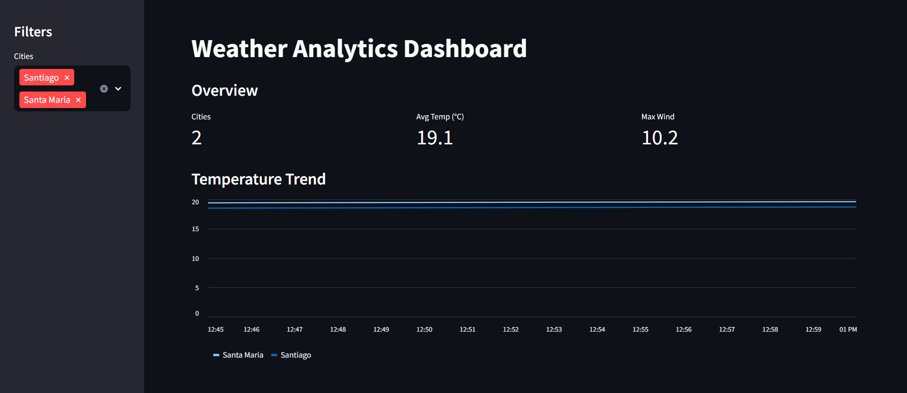
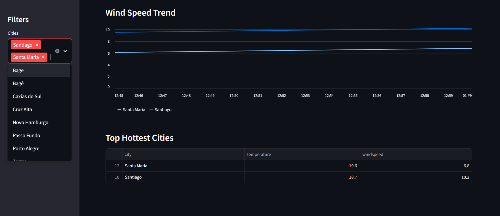

# Weather ETL Pipeline

A Data Engineering project that implements an ETL (Extract, Transform, Load) pipeline to collect, process, and store real-time weather data.

## Overview

This project consumes data from a public weather API, processes and structures the data, stores it in a local database, and provides an interactive dashboard for analysis.

Pipeline flow:

```
API → Extract → Transform → Load → SQLite → Dashboard
```


## Features

- Multi-city weather data extraction
- Data transformation and structuring using Pandas
- Storage in SQLite database
- Historical data tracking over time
- Interactive dashboard built with Streamlit
- City comparison (temperature and wind speed)
- Ranking of cities by temperature

## Architecture

The project follows a simple and modular ETL architecture:

* **Extract:** HTTP requests to the API using coordinates from a JSON file
* **Transform:** Data processing using Pandas
* **Load:** Data insertion into SQLite database
* **Visualization:** Streamlit dashboard for analysis

## City Configuration

* Cities are stored in a JSON file instead of environment variables for better scalability and maintainability.

## Technologies

* Python 3.x
* Pandas
* Requests
* SQLite
* Streamlit

## How to Run

### 1. Clone the repository

```bash
git clone https://github.com/limarobs/weather-etl-pipeline
cd weather-etl-pipeline
```

### 2. Install dependencies

```bash
pip install -r requirements.txt
```

## 3. Environment Variables

Create a `.env` file:

```env
API_URL=https://api.open-meteo.com/v1/forecast
```
### 4. Run the pipeline

```bash
python -m src.main
```
### 5. Run the dashboard

```bash
streamlit run dashboard.py
```

## Dashboard

The project includes an interactive dashboard built with Streamlit.

# Features

- Multi-city comparison
- Temperature and wind speed trends
- Real-time data visualization
- City ranking based on latest data

# Preview





